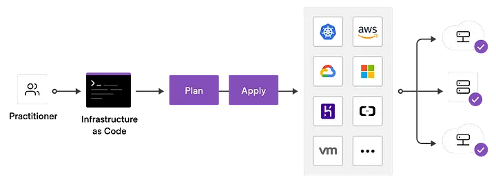
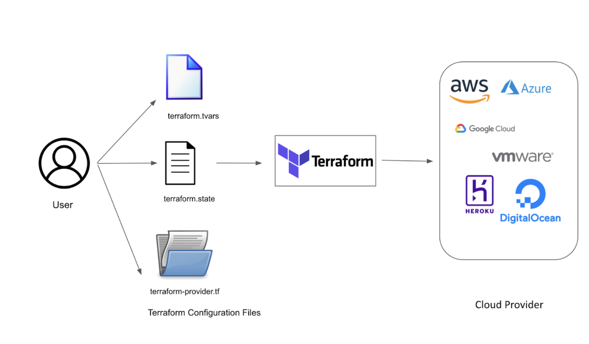
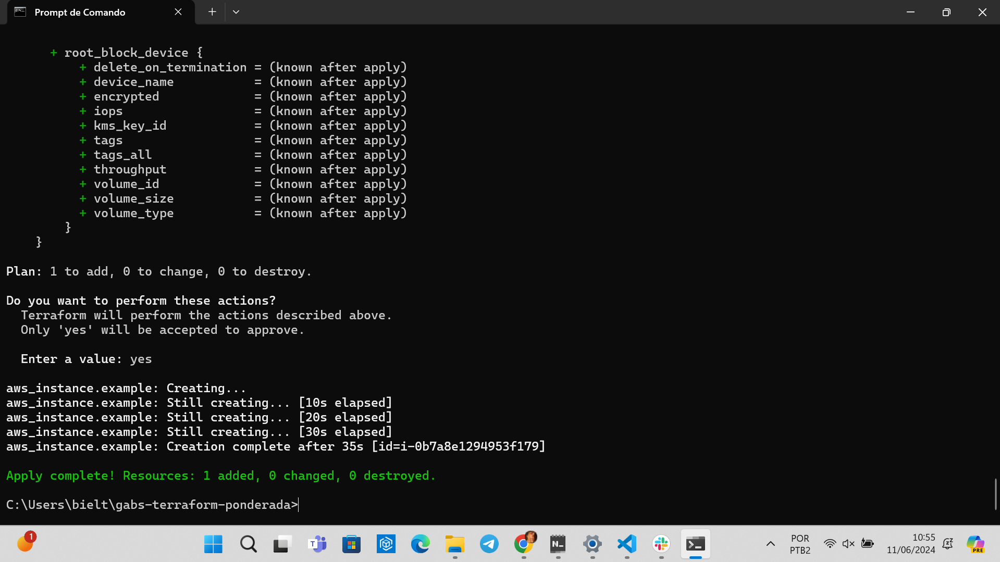
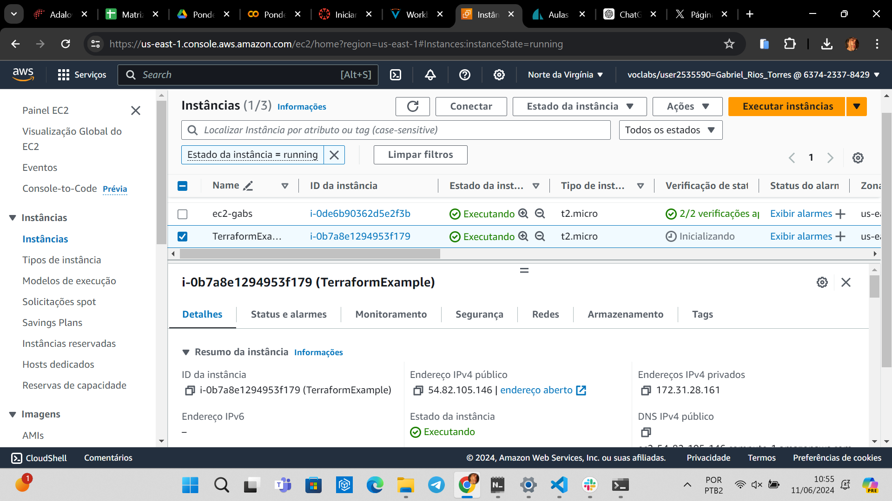
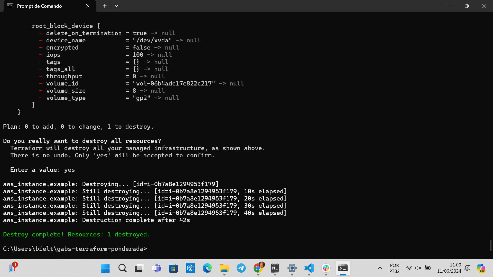
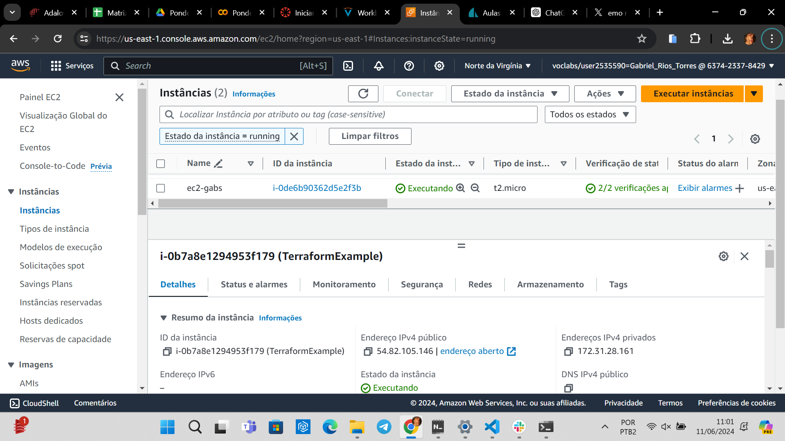

<h1>Ponderada de Terraform da semana 7 do Gabs</h1>

<h2> Sumário </h2>

- [1. Conceitos](#1-conceitos)
- [1.1 Infraestrutura como Código](#11-infraestrutura-como-código)
- [1.2 Terraform](#12-terraform)
- [2. Ponderada](#2-ponderada)
- [3. Referências](#3-referências)
 
 
 
 
 
 
 
# 1. Conceitos
## 1.1 Infraestrutura como Código

HASHICORP. What is Infrastructure as Code with Terraform?. Disponível nas Referências [1].

Infraestrutura como Código (IaC) é uma abordagem que permite gerenciar e provisionar recursos de tecnologia da informação (TI) por meio de arquivos de configuração, em vez de processos manuais. Esses arquivos de configuração descrevem a infraestrutura desejada de maneira declarativa ou imperativa, e são usados por ferramentas de automação para criar e gerenciar os recursos de TI necessários.

Imagine que você está construindo uma cidade e precisa garantir que todas as casas, ruas e serviços estejam exatamente no lugar certo. Tradicionalmente, você faria isso manualmente, um tijolo de cada vez, o que pode levar muito tempo e causar muitos erros.

Agora, pense que você tem um plano detalhado no papel, que descreve exatamente onde cada casa, rua e serviço deve estar. Em vez de construir tudo manualmente, você entrega esse plano a um robô que é capaz de seguir as instruções e construir tudo automaticamente, exatamente como descrito no papel.

Infraestrutura como Código (IaC) é como esse plano detalhado. Em vez de configurar servidores e redes manualmente, você escreve um arquivo de configuração que descreve exatamente como a infraestrutura deve ser. Esse arquivo é então entregue a uma ferramenta de automação (o "robô"), que lê as instruções e cria toda a infraestrutura automaticamente, de forma precisa e repetível.

Por exemplo:

-  **Sem IaC**: Você precisa configurar um servidor. Então, você entra no servidor, instala o sistema operacional, configura a rede, instala as aplicações, e assim por diante. Isso precisa ser feito para cada servidor, o que pode ser trabalhoso e propenso a erros.

- **Com IaC**: Você escreve um arquivo que diz "quero 3 servidores, cada um com esse sistema operacional, essa configuração de rede, e essas aplicações instaladas". A ferramenta de IaC lê esse arquivo e faz tudo isso por você, em questão de minutos.

## 1.2 Terraform

Terraform: Gerenciamento de Infraestrutura como Código com Exemplos Práticos. Disponível nas Referências [2].

Terraform é uma ferramenta de infraestrutura como código (IaC). 

Ela permite que você defina e provisione a infraestrutura de TI em várias plataformas de forma segura e eficiente usando uma linguagem de configuração simples e declarativa.

Com o Terraform, você escreve arquivos de configuração que descrevem os recursos de infraestrutura desejados. Esses recursos podem incluir servidores, balanceadores de carga, redes, bancos de dados, entre outros.

Uma vez que a infraestrutura está definida nos arquivos de configuração, você pode usar o Terraform para criar e gerenciar esses recursos automaticamente. Ele se conecta aos provedores de serviços (como AWS, Azure, Google Cloud, etc.) para provisionar e gerenciar os recursos conforme especificado.

Antes de aplicar as mudanças, o Terraform gera um plano de execução que mostra o que será alterado, adicionado ou removido. Isso permite que você revise as mudanças antes de aplicá-las, minimizando riscos. Após revisar o plano de execução, você pode aplicar as mudanças, e o Terraform provisiona ou modifica os recursos conforme necessário. O Terraform mantém um arquivo de estado que registra a infraestrutura gerenciada, permitindo que ele rastreie recursos e suas mudanças ao longo do tempo.

# 2. Ponderada
A ponderada da semana tem como objetivo criar uma Instância EC2 com Terraform. O passo a passo que foi realizado segue abaixo.

1. Instalação do Terraform CLI (via Powershell - Administrador)
2. Instalação do AWS CLI (via Powershell - Administrador)
3. Configuração das credenciais AWS (via Powershell - Administrador)
4. Criação do arquivo main.tf
5. Inicialização do terraform (`terraform plan`)
6. Aplicando a configuração (`terraform apply`)

7. Verificar a criação da instância na AWS

8. Limpando a infraestrutura (`terraform destroy`)

9. Verificar se a instância foi deletada

10. Documentação

O tutorial do Professor Afonso está disponível no [link](https://aulas-ttox.onrender.com/mod10es/cloud).

# 3. Referências

[1]. HASHICORP. What is Infrastructure as Code with Terraform?. Disponível no [link](https://developer.hashicorp.com/terraform/tutorials/gcp-get-started/infrastructure-as-code?in=terraform%2Fgcp-get-started). Acesso em: 16 jun. 2024.

[2]. ALVES JUNIOR, Dario. Terraform: Gerenciamento de Infraestrutura como Código com Exemplos Práticos. 28 abr. 2023. Disponível no [link](https://www.linkedin.com/pulse/terraform-gerenciamento-de-infraestrutura-como-c%C3%B3digo-alves-junior/). Acesso em: 16 jun. 2024.

